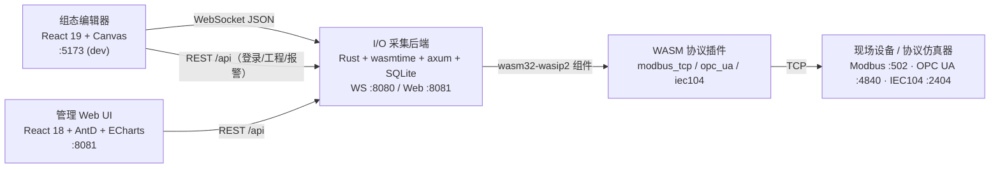
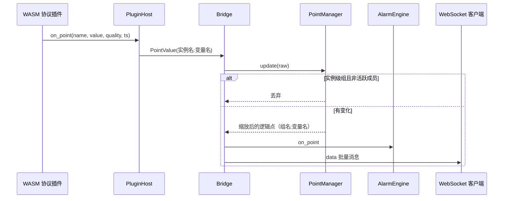
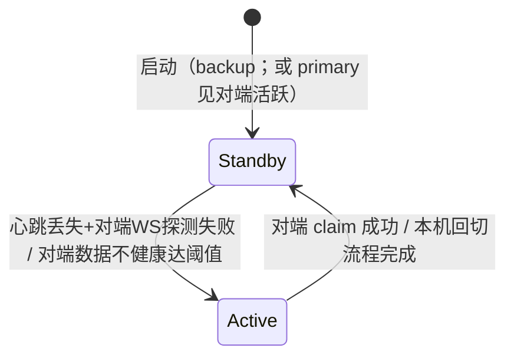

# HMI Editor 系统架构

本文档描述 HMI Editor 的整体架构：前端组态编辑器、Rust/WASM I/O 采集后端、管理 Web UI 三部分的模块划分、核心机制、数据流与关键设计决策。领域术语以 [CONTEXT.md](CONTEXT.md) 为准，已接受的架构决策见 [docs/adr](docs/adr/)。

## 1. 系统总览

系统由三个可独立部署/启动的组件组成：



**组态编辑器（`src/`）**：离线优先的 HMI 画面配置工具。核心逻辑全部放在 `src/core/`（不依赖 React），React 组件只负责交互与展示；Zustand store 是唯一状态中枢。

**I/O 采集后端（`io-backend/`）**：负责协议接入、点位缩放、实时推送、报警/SOE、主备冗余、工程与用户管理。协议接入采用 WASM 插件（WASIp2 组件），由 wasmtime 47 宿主加载，插件与宿主之间以 `hmi-plugin.wit` 契约为界。

**管理 Web UI（`io-backend/web-ui/`）**：后端自带的管理控制台，构建产物由后端 :8081 直接托管（SPA fallback），用于插件/点位/监控/报警/冗余的集中配置与监视。

## 2. 仓库结构

```
src/                              # 组态编辑器
├── core/                         # 框架无关核心引擎
│   ├── shapes/                   # 图元：基础图元 + 组/图片 + 地铁专用图元 + 图元库
│   ├── scene/                    # SceneGraph / Renderer / 缩放 / 动画几何
│   ├── view/                     # Viewport（缩放平移）/ 页面分辨率
│   ├── history/                  # 命令历史（撤销/重做）
│   ├── inspector/                # 图元树 / 换序 / 成组
│   ├── serialization/            # 场景序列化
│   ├── variables/                # 变量（点）定义与运行时值
│   ├── bindings/                 # 绑定引擎 / 动画引擎 / 值映射
│   ├── io/                       # DataBridge / WebSocketClient / IEC104 模拟
│   ├── settings/                 # 连接配置持久化
│   ├── project/                  # 工程 / 工程包 / 远程同步 / 备份 / 升级
│   ├── autosave/                 # IndexedDB 自动保存
│   ├── alarm/                    # 报警与 SOE（remote + local 降级）
│   ├── historian/                # 历史采样与降采样查询
│   ├── auth/                     # 本地 RBAC + 远端 JWT 客户端
│   ├── script/                   # 沙箱脚本引擎
│   ├── report/                   # 报表引擎
│   ├── svg/                      # SVG 导入（转换/变换/XML）
│   └── raster/                   # 栅格图导入
├── editor/                       # React 组件（画布/工具栏/检查器/面板/对话框）
└── store/editorStore.ts          # Zustand 状态中枢

io-backend/                       # Rust/WASM I/O 后端（Cargo workspace）
├── wit/hmi-plugin.wit            # WASM 插件契约（单一来源）
├── crates/
│   ├── bin/                      # hmi-io-backend 可执行文件（装配层）
│   ├── config/                   # hmi-io-config：YAML/DB 配置模型与校验
│   ├── db/                       # hmi-io-db：SQLite schema、迁移、Repo
│   ├── point/                    # hmi-io-point：PointManager + 节点级冗余引擎
│   ├── plugin/                   # hmi-io-plugin：wasmtime 宿主、插件注册表
│   ├── bridge/                   # hmi-io-bridge：点流 → 批量广播
│   ├── monitor/                  # hmi-io-monitor：状态/点位/报文采集
│   ├── server/                   # hmi-io-server：WebSocket 服务
│   ├── web/                      # hmi-io-web：REST API + SPA 托管
│   ├── alarm/                    # hmi-io-alarm：报警/SOE 引擎与持久化
│   ├── auth/                     # hmi-io-auth：JWT + Argon2id + 权限
│   ├── project/                  # hmi-io-project：工程包磁盘存储
│   ├── plugins/                  # WASM 插件 guest：modbus-tcp / opc-ua / iec104
│   ├── shared/                   # 共享协议 codec：iec104-core / ua-core
│   └── test-servers/             # iec104-slave(:2404) / opcua-server(:4840)
├── plugins/                      # 编译产物 *.wasm
├── web-ui/                       # 管理 Web UI（React/Vite/AntD）
└── config.yaml                   # 默认配置（首启迁移进 hmi_io.db）
```

## 3. 组态编辑器架构

### 3.1 分层与状态中枢

编辑器采用"引擎层（core）— 状态层（store）— 展示层（editor）"三层结构：

- `src/core/` 是纯 TypeScript 引擎集合，不 import React，便于单元测试与复用。
- `src/store/editorStore.ts` 是 Zustand 全局 store，启动时一次性实例化全部引擎（`SceneGraph`、`SceneEditor`、`VariableManager`、`BindingEngine`、`AnimationEngine`、`DataBridge`、`ProjectManager`、`AlarmManager`、`Historian`、`AuthManager`、`ScriptEngine`、`ReportEngine` 等），并暴露订阅切片与操作函数。
- `src/editor/` 只消费 store：左侧多 Tab 面板（图元库/点表/连接/页面/报警/趋势/权限/脚本/报表）、中间画布、右侧统一检查器、顶部工具栏与状态栏。

主要 UI 布局：

```
┌──────────┬─────────────────────┬──────────────────────┐
│ 图元库    │                     │ 图元树（z 序、组层级）  │
│ 点表      │     画布            ├──────────────────────┤
│ 连接      │  （Canvas 渲染）    │ 属性 / 绑定 / 动画     │
│ 页面/报警  │                     │                      │
│ 趋势/权限  │                     │                      │
│ 脚本/报表  │                     │                      │
└──────────┴─────────────────────┴──────────────────────┘
```

### 3.2 图元系统

所有图元继承 `ShapeBase`，实现 `render(ctx)`、`hitTest(point)`、`clone()`/`fromJSON()`/`toJSON()`。工厂 `createShape(type, props)` 按类型创建实例，当前支持 15 种：

| 类别 | 类型 |
| --- | --- |
| 基础图元 | rect、circle、line、text、polyline、polygon、path |
| 容器/资源 | group、image |
| 轨道交通专用 | metro-breaker、metro-busbar、metro-fan、metro-signal、metro-gauge、metro-transformer |

关键机制：

- **组（GroupShape）**：子图元坐标相对组原点，整体移动/缩放/旋转保持相对布局；画布命中与变换以组为原子单位。
- **图元库**：工程级 `ProjectData.library` 数据，条目是任意单个图元（含组）的序列化定义；放置时深拷贝并重新生成 ID，之后与库项无关；支持覆盖更新与显式重新同步。内置图元只读，自定义图元可放入用户自定义分组。
- **导入**：SVG 导入器解析 shape/transform/gradient/path 等并转换为原生图元（含组）；栅格导入器把 PNG/JPG 转成 `ImageShape`（data URL 随工程持久化，打包时抽到 assets/）。
- **检查器/图元树**：右栏顶部按 z 序（最上层优先）递归展示顶层与组内子图元；组内子图元只能在树中选中编辑，画布只画只读高亮；支持同父拖拽换序、可见/锁定、重命名、删除（仅顶层）。
- **图元编辑事务（Shape Edit Transaction）**：`SceneEditor`（`src/core/scene/SceneEditor.ts`）是图元编辑的统一入口，动词接口（`updateShapeAt`/`addShape`/`deleteShape`/`group`/`ungroup`/`reorder`/`beginShapeEdit`/`endShapeEdit`/`applyShapeResize`/`applyBatch`）统一完成「变更场景 → 记录命令 → 重建绑定索引 → 重绘 → 通知」的收尾语义（`finishEdit`），撤销/重做与正向编辑共用同一收尾，避免语义漂移；store 的编辑动作退化为薄委托，消除逐动作重复的编辑仪式。依赖全部注入（scene/bindingEngine/renderer/回调），不接触 React 与 store。
- **命令历史**：`SceneEditor` 持有每页独立的 `CommandHistory`（`activatePage`/`resetHistories`/`deletePageHistory` 管理其生命周期），以序列化快照记录新增/删除/属性修改/换序，支持批量命令（成组/取消成组）与子图元路径寻址；连续编辑（拖拽移动/缩放）在 `beginShapeEdit`/`endShapeEdit` 配对内只记录一条命令（`record=false` 的中间帧不入历史）；撤销/重做作用于 `SceneGraph` 后重建绑定索引、重绘并恢复选中结果。

### 3.3 场景、画布与视图

- `SceneGraph` 用 `Map<id, Shape>` 存图元，脏标记延迟排序；命中测试按 zIndex 从高到低反查；支持区域查询（框选）。
- `Renderer` 绑定 Canvas，绘制网格背景 → 图元 → 选中包围框与 8 个手柄；`resize`/`scaling` 模块处理物理像素与图元缩放（文字等特殊图元按角点规则缩放）。
- `Viewport` 管理编辑视图变换（zoom 10%–800%、pan、锚点缩放、适配页面），只影响显示，不改图元坐标；每个页面的视图状态随自动保存持久化。
- 页面拥有独立分辨率（逻辑宽高）与背景色；`EditorCanvas` 支持选择/框选/拖拽、工具创建、缩放平移、吸附（snap）、键盘快捷键（Delete、Ctrl+C/V、Ctrl+G 成组、Ctrl+Shift+G 取消成组、Ctrl+Z/Y 等）；画布编辑动作全部经 `SceneEditor` 事务落盘撤销历史（拖拽移动/缩放以 `beginShapeEdit`/`endShapeEdit` 配对记录单条命令，删除/成组/换序为原子操作）。

### 3.4 变量、绑定与动画

**变量（点表）**：四类 `AI/DI/AO/DO`；`VariableManager` 保存定义（量程、单位、报警限等）与运行时值（数值、质量、时间戳），提供单点与全量订阅。模拟模式下生成正弦波 + 随机跳变。

**绑定引擎**：订阅所有变量变化 → 反向索引（`variableId → [{shapeId, binding}]`）→ 值映射 → 写图元属性 → 触发重绘。映射策略：

| 映射 | 行为 |
| --- | --- |
| `direct` | 原值直传 |
| `enum` | 值 → 字符串查表 |
| `range` | 线性插值（如 0–2000A → 0–360°） |
| `stateColor` | 数值 → 颜色 |
| `bitmask` | 按位解析多状态 |

数值型绑定属性支持平滑过渡（默认 300ms ease-out）。

**动画引擎**：基于 `requestAnimationFrame` 驱动五种动画（blink/rotate/move/scale/colorShift），可绑定变量控制 `speed`/`strength`/`enabled`；地铁风机等图元还保留自身的旋转动画机制。

### 3.5 数据 I/O 与连接

`DataBridge` 统一管理数据源生命周期并把数据路由到 `VariableManager`，活跃源类型为 `simulation | iec104 | websocket | io_backend`：

- **模拟**：VariableManager 内置周期模拟。
- **IEC 104 模拟器**：内置地铁典型点位模板与正弦/随机波形，可配置扫描周期、延迟、丢包。
- **IO 后端（WebSocket）**：`WebSocketClient` 支持 `urls: string[]`（主在前），断线按序快速轮询重连、30s 心跳；连接面板可同时配置主备 WS 地址与主备 REST API 地址。

WebSocket 消息协议（与后端对齐）：

| 方向 | type | 说明 |
| --- | --- | --- |
| 服务端 → 客户端 | `snapshot` | 连接后全量点值 |
| 服务端 → 客户端 | `data` | 批量点值变化（默认 100ms 一批） |
| 服务端 → 客户端 | `config_change` | 点表在管理端变更，前端刷新变量列表 |
| 服务端 → 客户端 | `alarm_rules` / `alarm_snapshot` | 报警规则与活跃报警初始态 |
| 服务端 → 客户端 | `alarm_update` / `soe` | 报警事件与 SOE 增量 |
| 服务端 → 客户端 | `alarm_rules_changed` | 规则变化通知 |
| 服务端 → 客户端 | `role` | 冗余降级广播（standby）后服务端断开全部 WS |
| 客户端 → 服务端 | `subscribe` | 按变量 ID 订阅过滤 |
| 客户端 → 服务端 | `control` | 控制写点 `{variableId, value}` |

`DataBridge` 维护内部变量 ID ↔ 后端点 ID 的映射，并把最近收到的点值缓存用于导入点表后重放，避免快照早于变量定义到达导致丢值。

### 3.6 工程管理

工程采用"本地优先 + 后端同步"：

- **自动保存**：停止编辑约 1s 后防抖写入 IndexedDB 快照（含页面、图元、图元库、页面视图状态），启动时自动恢复；页面切换/关闭前 flush。
- **草稿备份**：定期把快照写入 IndexedDB 草稿存储，损坏或误操作时可回滚。
- **工程包**：`.hmi.zip` = `manifest.json`（schemaVersion=1 + 资源清单）+ `assets/`；图片 data URL 抽为 `asset://<id>` 引用，导入时还原。旧 `.hmi.json` 导入时按版本升级并归一化旧字段。
- **远程同步**：经 `RemoteAuthClient`（JWT）调用后端 `/api/projects`；推送使用 `?version=` 乐观锁，冲突返回 409；同步为显式操作（登录/远程工程列表/推送/拉取对话框），并处理会话过期、断线超时与大型压缩包阻塞问题。

### 3.7 报警与 SOE

前端 `AlarmManager` 有两种模式：

- **remote（默认连接后端）**：消费 WS 推送（规则、快照、更新、SOE），查询/确认走 REST；后端 Active 节点是唯一事实来源。
- **local（仿真降级）**：未连接后端时用同一语义的本地引擎计算（条件、滞回、确认延时、质量保持、SOE），UI 必须标注"模拟"。

### 3.8 历史 / 脚本 / 报表 / 权限

- `Historian`：周期采样（默认 2s）进环形缓冲，查询时降采样保证趋势渲染性能。
- `ScriptEngine`：`new Function("sandbox", code)` 受限沙箱，提供 `getVar/setVar/log/now/sleep/Math/JSON` API，支持 startup/cycle/manual 触发（自动控制风机等闭环示例）。
- `ReportEngine`：从历史数据生成 CSV/HTML 报表并触发下载。
- `AuthManager`：本地 RBAC（admin/engineer/operator/viewer）+ 审计日志；连接后端后由 `RemoteAuthClient` 完成登录、令牌刷新与远程工程授权。

## 4. I/O 采集后端架构

### 4.1 Crate 职责

| Crate | 职责 |
| --- | --- |
| `bin` | 装配层：读配置/迁移 DB、构造全部组件、启动 WS/Web 服务与后台任务 |
| `config` | 配置模型（server/plugins/alarm/redundancy）与校验 |
| `db` | SQLite schema、幂等迁移、Repo 数据访问 |
| `point` | PointManager（点位缓存/缩放/组门控）+ 节点级冗余引擎 |
| `plugin` | wasmtime 组件宿主（host.rs）、契约生成（interface.rs）、插件注册表与实例监督器（registry.rs） |
| `bridge` | 插件点流 → PointManager → 批量 WS 广播 + 报警引擎喂入 |
| `monitor` | 插件状态、点值、报文追踪与 1s 趋势采样 |
| `server` | WebSocket 服务（快照/订阅/过滤/控制/降级断开） |
| `web` | REST API、认证路由、工程路由、SPA 托管 |
| `alarm` | 报警/SOE 状态机、规则管理、持久化广播任务 |
| `auth` | JWT、Argon2id、角色权限矩阵 |
| `project` | `.hmi.zip` 磁盘存储、版本乐观锁、审计 |
| `plugins/*` | Modbus TCP / OPC UA / IEC 104 插件 guest |
| `shared/*` | 共享协议编解码（iec104-core、ua-core） |
| `test-servers/*` | IEC 104 从站与 OPC UA 服务器（E2E 用） |

### 4.2 启动流程

`cargo run -- config.yaml` 的装配顺序：

1. 打开 SQLite `hmi_io.db`，幂等迁移；首次把 `config.yaml` 写入 DB（此后配置以 DB 为准）。
2. 种子 `admin` 用户（随机 16 位密码打印在日志，强制改密）；初始化 `AuthService`（`HMI_JWT_SECRET` 或持久化 secret）。
3. 加载报警规则与未恢复报警，构造 `AlarmEngine` + 持久化任务。
4. 构造 `PluginRegistry`、`PointManager`、`Bridge`（batch 广播）、`MonitorCollector`。
5. 构造 `RedundancyEngine`，探测对端并决定初始角色：Active 立即启动插件实例；Standby 只 prepare（记录插件目录与配置缓存、重建实例组），插件延迟到升主后启动。
6. 启动实例级监督器、报警 tick（100ms）、保留数据清理（1h）、趋势采样（1s）、WS 服务（:8080）与 Web 服务（:8081）。

### 4.3 WASM 插件系统

契约 `io-backend/wit/hmi-plugin.wit`（package `hmi:plugin`）是宿主与 guest 共享的单一来源：

- 插件导出（async）：`init(config-json)`、`connect()`、`disconnect()`、`scan-points()`、`write-point(name, value)`、`get-name()`、`get-status()`。
- 插件导入（async）：`log(level, message)`、`on-point(name, value, quality, timestamp)`、`on-packet(direction, protocol, hex, summary)`。

宿主实现要点：

- wasmtime 组件 API：`bindgen!` + `Component::instantiate_async`，导出通过 `run_concurrent` 调用。
- `WasiCtx` 必须 `.inherit_network()` 并 `concurrency_support(true)`，否则插件 TCP 连接被拒绝。
- 插件事件（log/on-point/on-packet）以 `events::HostWithStore` 实现：`on_point` 拼上实例名前缀后经 mpsc 送 Bridge，`on_packet` 送 MonitorCollector。
- `registry` 为每个实例维护 actor：周期 `scan-points`、写点命令、状态查询、`scan-points` 返回非零时自动重连（限速 5s 一次）；插件 `connect()` 必须可重入（清 socket/计数、保留点位、失败路径置 connected=false）。
- 实例级冗余监督器按扫描周期检查活跃成员健康（connected 且扫描新鲜），连续失败达到阈值并过冷却后按 priority 切换活跃成员，回切时先探测 primary。

三个协议插件：

| 插件 | 实现 |
| --- | --- |
| modbus-tcp | 基于 `modbus` crate v1.1，bool 走线圈、16 位单寄存器、32 位连续双寄存器按 `byte_order` 组字；解码后应用 `scale`/`offset` |
| opc-ua | 自建 UA TCP 栈（复用 `ua-core`）：HEL/ACK → OPN → CreateSession → ActivateSession（匿名或用户/密码）；每扫描批量 ReadRequest 直到 ReadResponse；控制走 WriteRequest；断开时 CloseSession + CloseSecureChannel |
| iec104 | 自建 104 栈（复用 `iec104-core`）：connect 发 STARTDT 等 STARTDT_CON（其间回 TESTFR），然后总召唤；`scan-points` 排空缓冲帧并按批回 S 帧，每 120 次重对时 + 总召唤，35s 空闲发 TESTFR，70s 超时断开；命令跟踪 ACT_CON 且 30s 未确认作废 |

### 4.4 点位数据路径



要点：

- 点 ID 规则：普通实例为 `{实例名}:{variable_id}`；实例级冗余组为 `{组名}:{variable_id}`。
- `PointManager` 只广播当前活跃成员的值；写命令经 `registry.write_point` 路由到活跃实例，前端绑定不受切换影响。
- Bridge 以 `batch_interval_ms`（默认 100ms）批量广播；无变化不推送。
- WS 服务端连接即发 `snapshot`（含当前全部值），随后按每连接订阅过滤广播；Standby 节点拒绝新连接，降级时广播 `{"type":"role","state":"standby"}` 并断开全部客户端。

### 4.5 节点级冗余（双机热备）

`redundancy.enabled: true` 时启用，位于 `crates/point/src/redundancy/`：

- **静态角色**：`role: primary|backup` + `node_id`；启动时探测对端心跳决定初始状态（主见对端活跃则先 Standby）。
- **心跳**：复用 Web 端口 `GET /api/redundancy/heartbeat`，携带本机 `state`、`config_version`、`data_healthy`、插件连接数等。
- **升主**：备机连续 `failover_threshold` 次心跳失败 **且** 对端 WS 端口（`peer_ws_port`）TCP 探测失败时升主；对端心跳正常但上报 `data_healthy=false`（无插件 connected 且最近 3 个扫描周期无成功扫描）连续 `plugin_unhealthy_threshold` 次时也可 claim 接管，受 `plugin_promotion_cooldown_ms` 冷却限制。
- **同步**：Active 经 Bridge 广播点值，并 `POST /api/redundancy/sync` 推给备机；备机 `PointManager::apply_sync` 直接写缓存（不二次缩放）；按 `full_snapshot_interval_ms` 补全量快照。
- **回切**：恢复的主机以 Standby 进入，心跳稳定 `failback_delay_ms` 后先探测本机数据就绪（bin 启动插件并轮询连接，最长 8s），成功才 `POST /api/redundancy/claim`；避免双机都不健康时反复横跳。
- **配置快照**：Active 在插件/点位/冗余配置变更后递增 `config_version` 并 `POST /api/redundancy/config/push`，备机事务性替换本地 DB。



### 4.6 实例级冗余（单机内）

独立于节点级开关：插件实例通过 `redundancy_group` + `redundancy_role(primary|backup)` + `priority` 成组。配置校验要求组内恰好 1 个 primary、backup 的 priority 组内唯一、主备 `variable_id` 集合完全一致。

- 组监督器每扫描周期检查活跃成员（connected 且扫描新鲜），连续 `instance_failover_threshold` 次失败且过 `instance_switch_cooldown_ms` 后按 priority 升序接管（全失败后环形回 primary）。
- `instance_failback_enabled` 时按 `instance_failback_delay_ms` 探测 primary 并回切。
- `GET /api/redundancy/instance-groups` 返回组状态；`/api/points` 默认只返回 primary/独立实例点位，`?include_backup=true` 返回全部。

### 4.7 报警与 SOE 引擎

报警权威计算只发生在 Active 节点（`crates/alarm/`）：

- **规则**：`id/variable_id/name/severity/group/condition/threshold/enabled/hysteresis/confirm_ms`，存 `alarm_rules` 表；YAML 首启种子，后续以管理 UI/REST 为唯一写入口。
- **评估**：Bridge 每次点位变化喂给 `AlarmEngine.on_point`；先记 SOE（变位即记，毫秒精度、含质量、设备时间优先），质量非 `good` 时暂停阈值判定（质量保持）；条件支持 high/low/equal/notEqual/change（change 为瞬时报警）；`confirm_ms > 0` 时先入候选，由 100ms tick 在持续超限后确认触发。
- **状态**：occurrence 生命周期 active → acknowledged → recovered，未确认的恢复报警单独保留到确认；恢复带滞回。
- **持久化/广播**：persister 任务写 SQLite（occurrences/stream events/soe）并广播 `alarm_update`/`soe`/`alarm_rules_changed`；每小时按保留天数清理（默认报警 90 天、SOE 30 天）。
- **启动恢复**：重启/升主时从 DB 恢复活跃与未确认恢复报警，并用当前点值重建判定。

### 4.8 数据库

SQLite（`hmi_io.db`），主要表：

| 表 | 内容 |
| --- | --- |
| `server_config` | 键值配置（端口、目录、保留天数、jwt_secret、config_version 等） |
| `plugins` / `points` | 插件实例与点位映射（含实例级冗余列） |
| `alarm_rules` / `alarm_occurrences` / `alarm_stream_events` / `soe_events` | 报警与 SOE |
| `projects` / `project_audit_log` | 工程元数据与审计 |
| `users` | 用户（Argon2id 哈希、角色、token_version） |

迁移全部幂等（`CREATE TABLE IF NOT EXISTS` + 按 `pragma_table_info` 补列）。

### 4.9 Web API 与管理 UI

后端在 :8081 提供 REST API，并按 SPA fallback 托管 `web-ui/dist`：

| 分组 | 路由 |
| --- | --- |
| 插件 | `GET/POST /api/plugins`、`GET/PUT/DELETE /api/plugins/{id}` |
| 点位 | `GET/POST /api/points`、`PUT/DELETE /api/points/{id}`、Excel 导入导出 `/api/plugins/{id}/import|export`、`GET /api/config/export` |
| 监控 | `GET /api/monitor/overview`、`/api/monitor/plugins/{name}/status|points|packets`、`/api/monitor/history` |
| 报警/SOE | `/api/alarm/rules` CRUD、`/api/alarm/active`、`/api/alarm/history`、`/api/alarm/occurrences/{id}/events`、`/api/alarm/ack`、`/api/alarm/ack-all`、`/api/alarm/config`、`/api/soe` |
| 冗余 | `/api/redundancy/config` GET/PUT、`/config/push`、`/heartbeat`、`/sync`、`/snapshot`、`/claim`、`/status`、`/instance-groups` |
| 认证 | `POST /api/auth/login`、`POST /api/auth/refresh`、`POST /api/auth/change-password` |
| 工程 | `GET /api/projects`、`GET/PUT/DELETE /api/projects/{id}`（JWT + 角色权限） |

管理 UI 页面：运行总览、协议插件、点位配置、实时监控、报警监控、报警规则、冗余配置、冗余监控；开发模式在 :5174 启动并把 `/api` 代理到 :8081。报警规则编辑只存在于管理端（HMI 编辑器仅在仿真模式提供简化本地版本）。

### 4.10 认证与工程存储

- **认证**：JWT（access 30min + refresh 7d，`token_version` 支持吊销），密码 Argon2id；角色 `admin/engineer/operator/viewer`，admin/engineer 可读写删工程，operator 只读，viewer 无工程权限。
- **工程存储**：SQLite `projects` 存元数据，磁盘 `projects/` 下每个工程一份 `.hmi.zip`（上限 100MB）；上传为整包校验 + 临时文件 + 事务性替换；`PUT ?version=` 乐观锁，冲突 409；所有写操作记审计日志。

## 5. 关键设计决策

| 决策 | 内容 | 依据 |
| --- | --- | --- |
| 报警/SOE 后端权威 | 只有 Active 节点计算与持久化，前端只展示/确认；仿真模式本地降级并标注"模拟" | ADR-0001 |
| 规则唯一写入口 | 报警规则编辑收敛到管理 UI；编辑器连接后端时不展示规则界面 | ADR-0002 |
| 工程本地优先 + 后端同步 | IndexedDB 自动保存保证离线编辑；`.hmi.zip` 整包 + 版本乐观锁用于跨设备同步 | ADR-0003 |
| 工程 API 用 JWT | 独立 SPA 跨源访问，Bearer 干净；用户与角色由后端统一管理 | ADR-0004 |
| 图元库工程级 + 副本语义 | 放置即深拷贝，之后与库项无关；覆盖更新/重新同步为显式操作 | ADR-0005 |
| 统一检查器 | 右栏 = 图元树 + 属性/绑定/动画；组内子图元仅树选编辑，画布保持组级原子变换 | ADR-0006 |
| 图元编辑事务 | `SceneEditor` 统一图元编辑的「变更→记录命令→重建绑定索引→重绘」收尾，撤销/重做与正向编辑共用语义；每页独立撤销历史 | — |
| WASM 插件契约 | `hmi-plugin.wit` 单一来源，宿主/guest 共享生成代码 | — |
| 双机热备 | 静态角色 + 心跳 + 数据健康 + 回切前数据就绪探测，避免脑裂与抖动 | — |

## 6. 构建、运行与测试

### 构建

```powershell
# 全量：WASM 插件 + Rust 后端 + 管理 UI
.\scripts\build.ps1 -Release

# 分步
.\scripts\build.ps1 -Release -PluginsOnly
.\scripts\build.ps1 -Release -BackendOnly
```

手动构建插件（workspace 根 `io-backend/`）：

```bash
cargo build --target wasm32-wasip2 -p modbus-tcp-plugin -p opc-ua-plugin -p iec104-plugin --release
```

### 运行

```powershell
.\scripts\dev.ps1
# 或
npm run dev
cd io-backend && cargo run -- config.yaml
```

默认端口：编辑器 dev :5173、管理 UI dev :5174、WS :8080（`/iscs/data`）、Web UI/API :8081、IEC 104 仿真从站 :2404、OPC UA 仿真服务器 :4840。

### 测试

```powershell
npm test                              # 前端 vitest（core 全部为纯 TS）
cd io-backend && cargo test           # 后端单元测试
cargo build -p iec104-slave -p opcua-server   # E2E 仿真器
```

## 7. 部署拓扑

**单机**：`redundancy.enabled: false`，一个后端进程同时承担 Active 采集、报警/SOE、管理 API；编辑器与管理 UI 可同时访问。

**双机热备**：两机使用同一配置（`role`/`node_id`/`peer_url`/`peer_ws_port` 按机设置），`redundancy.enabled: true`；Active 节点采集并推送，Standby 只收同步；心跳/数据健康触发切换，恢复后自动回切。前端 WS 配置 `urls: [主, 备]`，主节点故障时按序快速切换；连接面板另可配置备用 REST API 地址用于登录/工程同步。
