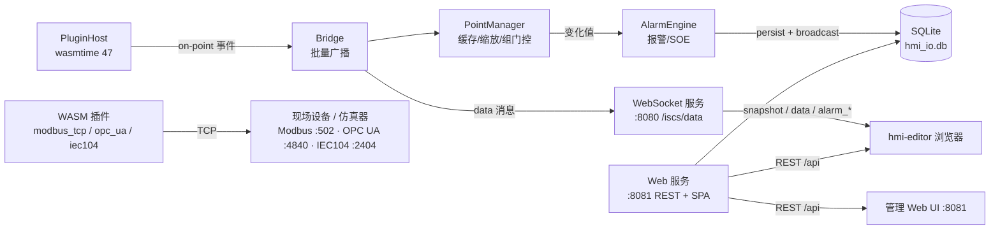

# HMI I/O Backend — Rust + WASM Plugin System

基于 Rust + wasmtime 的工业协议 I/O 后端，通过动态加载 WASM 插件（WASIp2 组件）实现 Modbus TCP、OPC UA、IEC 60870-5-104 到 SCADA 点位的实时采集与推送，并承担报警/SOE、主备冗余、工程存储、认证和管理 API。

## 功能特性

- **WASM 插件体系**：`wit/hmi-plugin.wit` 为宿主与插件共享的契约单一来源；插件独立编译为 `.wasm` 组件，运行在 wasmtime 47 沙箱内。
- **点位管理**：插件实例点表统一入库，HMI 点 ID = `实例名:变量名`（实例级冗余组为 `组名:变量名`）；支持 `data_type`/`byte_order` 解码与 `scale`/`offset` 缩放。
- **实时推送**：WebSocket 批量推送（默认 100ms）、连接快照、按变量订阅过滤、控制写点。
- **报警与 SOE**：规则（高/低/等于/不等于/变位）、级别、分组、滞回、确认延时；报警发生记录 + 明细事件 + SOE 持久化；默认保留报警 90 天、SOE 30 天。
- **双机热备（节点级）**：静态角色 + HTTP 心跳 + 数据健康上报 + 自动回切；备机只同步点值并拒绝 WS 连接。
- **实例级主备**：单机内 1 主 + 0..N 备，按 `priority` 接管，切换不改变前端绑定。
- **管理 API 与 Web UI**：插件/点位 CRUD、Excel 点位导入导出、实时监控、报警/SOE 查询、冗余配置、JWT 认证、`.hmi.zip` 工程存储（乐观锁 + 审计）。

## 架构



## 构建

### 前置条件

- Rust 1.82+（`wasm32-wasip2` 目标为 Tier 2）

  ```bash
  rustup target add wasm32-wasip2
  ```

- wasmtime 47 由 workspace `Cargo.toml` 引入，无需单独安装
- 管理 Web UI 构建需要 Node.js 20+（仓库根 `scripts/build.ps1` 已包含此步骤）

### 一键构建

```powershell
.\scripts\build.ps1 -Release
```

脚本位于仓库根 `scripts/`，从仓库根或 `io-backend/` 下运行均可。它依次构建：

1. WASM 插件（target `wasm32-wasip2`）并拷贝到 `plugins/`
2. Rust 后端二进制
3. 管理 Web UI（`web-ui/dist`）

分步构建：

```powershell
.\scripts\build.ps1 -Release -PluginsOnly   # 仅 WASM 插件
.\scripts\build.ps1 -Release -BackendOnly   # 仅 Rust 后端
.\scripts\build.ps1 -Release -SkipFrontend  # 跳过管理 UI
```

### 手动构建

```bash
# 在 io-backend/（workspace 根）执行
cargo build --target wasm32-wasip2 -p modbus-tcp-plugin -p opc-ua-plugin -p iec104-plugin --release
cp target/wasm32-wasip2/release/modbus_tcp_plugin.wasm plugins/modbus_tcp.wasm
cp target/wasm32-wasip2/release/opc_ua_plugin.wasm plugins/opc_ua.wasm
cp target/wasm32-wasip2/release/iec104_plugin.wasm plugins/iec104.wasm

# 构建后端（workspace 默认成员）
cargo build --release
```

## 运行

```bash
cd io-backend
cargo run -- config.yaml
```

服务启动后：

1. 首次启动把 `config.yaml` 迁移进本地 SQLite `hmi_io.db`，此后配置以数据库为准（删除 `hmi_io.db` 可重新迁移）。
2. 用户表为空时自动创建 `admin` 用户，随机初始密码打印在启动日志中，首次登录强制改密。
3. 未设置 `HMI_JWT_SECRET` 时自动生成并持久化 `jwt_secret`。
4. 加载报警规则与未恢复报警，启动报警持久化任务。
5. 探测冗余对端决定初始角色：Active 启动全部插件实例并周期性扫描（默认 500ms）；Standby 只记录配置、延迟启动插件。
6. 启动实例级冗余监督器、报警 tick（100ms）、保留数据清理（1h）、趋势采样（1s）。
7. 在 `ws://0.0.0.0:8080/iscs/data` 监听 WebSocket 推送（批量 100ms），在 `:8081` 提供管理 Web UI 与 REST API。

## 配置

编辑 `io-backend/config.yaml`：

```yaml
server:
  host: "0.0.0.0"
  port: 8080
  web_port: 8081
  path: "/iscs/data"
  project_dir: "./projects"
  batch_interval_ms: 100

plugins:
  directory: "./plugins"
  scan_interval_ms: 500
  instances:
    - name: "modbus_tcp"
      wasm_file: "modbus_tcp.wasm"
      config:
        host: "192.168.1.100"
        port: 502
        slave_id: 1
      points:
        - id: "STA1_211_ACB_STATUS" # HMI 点 ID = modbus_tcp:STA1_211_ACB_STATUS
          address: "coil:0"
          data_type: "bool"
          var_type: "DI"
        - id: "STA1_211_IA"
          address: "holding_register:0"
          data_type: "uint16"
          scale: 0.1
          var_type: "AI"
        - id: "STA1_211_ACB_CTRL"
          address: "coil:10"
          data_type: "bool"
          var_type: "DO"

alarm:
  enabled: true
  retention_alarm_days: 90
  retention_soe_days: 30
  rules:
    - id: "ALM_IA_OVER"
      variable_id: "modbus_tcp:STA1_211_IA"
      name: "A相过流"
      severity: "major"
      group: "供电/400V"
      condition: "high"
      threshold: 1600
      enabled: true

redundancy:
  enabled: false
  node_id: node-a
  role: primary
  peer_url: "http://192.168.1.2:8081"
  peer_ws_port: 8080
  heartbeat_interval_ms: 1000
  failover_threshold: 3
  failback_delay_ms: 30000
  full_snapshot_interval_ms: 5000
  plugin_unhealthy_threshold: 3
  plugin_promotion_cooldown_ms: 60000
  instance_failover_threshold: 3
  instance_failback_enabled: true
  instance_failback_delay_ms: 30000
  instance_switch_cooldown_ms: 60000
```

配置说明：

- `data_type`：`bool` / `int16` / `uint16` / `int32` / `uint32` / `float32`（默认 `uint16`）
- `byte_order`：`ABCD` / `BADC` / `CDAB` / `DCBA`（仅 modbus-tcp；未识别值按 `ABCD` 处理）
- 插件解码完成后统一应用 `scale`、`offset`
- 端口等运行时参数最终以 `server_config` 表为准（`ws_port`、`web_port`、`batch_interval_ms` 等）
- 报警规则只写入 `alarm_rules` 表，后续修改请走管理 UI/REST，YAML 仅作首次种子

### 实例级主备（1 主 + 0..N 备，单机内）

同一 `redundancy_group` 的实例共享一组逻辑变量（HMI ID = `组名:变量名`），backup 按 `priority` 升序接管，切换不改变前端绑定：

```yaml
plugins:
  instances:
    - name: iec104
      redundancy_group: dual-link
      redundancy_role: primary
      wasm_file: iec104.wasm
      config: { host: "127.0.0.1", port: 2404, common_address: 1 }
      points:
        - { id: "STA1_211_IA", address: "1003", data_type: "float32", var_type: "AI" }
    - name: opc_ua_backup
      redundancy_group: dual-link
      redundancy_role: backup
      priority: 1
      wasm_file: opc_ua.wasm
      config: { endpoint: "opc.tcp://127.0.0.1:4840" }
      points:
        - { id: "STA1_211_IA", address: "ns=2;s=Temperature.Zone1", var_type: "AI" }
```

校验要求：组内 primary 唯一；backup 必须填 `priority` 且组内唯一；主备实例 `variable_id` 集合完全一致。

## WebSocket 协议

地址：`ws://<host>:8080/iscs/data`（生产端口以 `ws_port` 配置为准）。

| 方向 | type | 说明 |
| --- | --- | --- |
| 服务端 → 客户端 | `snapshot` | 连接后全量点值快照 |
| 服务端 → 客户端 | `data` | 批量点值变化（`data: [{id, value, quality, timestamp}]`） |
| 服务端 → 客户端 | `config_change` | 点位在管理端变更，前端刷新变量定义 |
| 服务端 → 客户端 | `alarm_rules` / `alarm_snapshot` | 报警规则与活跃报警初始态（规则先发） |
| 服务端 → 客户端 | `alarm_update` | 报警触发/确认/恢复事件 |
| 服务端 → 客户端 | `soe` | SOE 增量 |
| 服务端 → 客户端 | `alarm_rules_changed` | 规则变化通知 |
| 服务端 → 客户端 | `role` | 冗余降级广播（`{"type":"role","state":"standby"}`），随后断开全部客户端 |
| 客户端 → 服务端 | `subscribe` | 按变量 ID 过滤（空列表 = 接收全部） |
| 客户端 → 服务端 | `control` | 控制写点 |

控制写点示例：

```json
{ "command": "control", "variableId": "modbus_tcp:STA1_211_ACB_CTRL", "value": 1 }
```

订阅示例：

```json
{ "command": "subscribe", "variableIds": ["modbus_tcp:STA1_211_IA"] }
```

## REST API

基础地址 `http://localhost:8081`：

| 分组 | 路由 |
| --- | --- |
| 插件 | `GET/POST /api/plugins`、`GET/PUT/DELETE /api/plugins/{id}` |
| 点位 | `GET/POST /api/points`（`?include_backup=true` 返回实例级备份点位）、`PUT/DELETE /api/points/{id}` |
| Excel | `POST /api/plugins/{plugin_id}/import`、`GET /api/plugins/{plugin_id}/export` |
| 配置导出 | `GET /api/config/export` |
| 监控 | `GET /api/monitor/overview`、`/api/monitor/plugins/{name}/status`、`/points`、`/packets`、`/api/monitor/history` |
| 报警/SOE | `/api/alarm/rules` CRUD、`/api/alarm/active`、`/api/alarm/history`、`/api/alarm/occurrences/{id}/events`、`/api/alarm/ack`、`/api/alarm/ack-all`、`/api/alarm/config`、`/api/soe` |
| 冗余 | `GET/PUT /api/redundancy/config`、`POST /api/redundancy/config/push`、`GET /api/redundancy/heartbeat`、`POST /api/redundancy/sync`、`GET /api/redundancy/snapshot`、`POST /api/redundancy/claim`、`GET /api/redundancy/status`、`GET /api/redundancy/instance-groups` |
| 认证 | `POST /api/auth/login`、`POST /api/auth/refresh`、`POST /api/auth/change-password` |
| 工程 | `GET /api/projects`、`GET/PUT/DELETE /api/projects/{id}`（JWT + 角色权限） |

工程推送使用 `PUT /api/projects/{id}?version=<n>` 乐观锁，版本过期返回 409；包体为 `.hmi.zip`（上限 100MB）。

## 管理 Web UI

后端在 :8081 直接托管 `web-ui/dist`（SPA fallback 到 `index.html`），页面：

- 运行总览 `/`
- 协议插件 `/plugins`
- 点位配置 `/points`
- 实时监控 `/monitor`
- 报警监控 `/alarm`
- 报警规则 `/alarm/rules`（规则唯一写入口）
- 冗余配置 `/redundancy`
- 冗余监控 `/redundancy/monitor`

开发模式：

```powershell
cd io-backend/web-ui
npm install
npm run dev   # http://localhost:5174，/api 代理到 :8081
```

依赖全部本地打包（无 CDN），构建产物可离线运行。

## 认证与工程存储

- **认证**：JWT（access token 30 分钟 + refresh token 7 天），密码使用 Argon2id；`token_version` 支持吊销。角色 `admin` / `engineer` / `operator` / `viewer`：admin 与 engineer 可读写删工程，operator 只读，viewer 无工程权限。
- **工程存储**：SQLite `projects` 表存元数据，磁盘 `projects/` 下每工程一份 `.hmi.zip`；上传整包校验、临时文件 + 事务性替换，所有写操作记 `project_audit_log`。
- 首启 `admin` 用户随机密码打印在日志中（`must_change_password = true`）；生产环境建议设置 `HMI_JWT_SECRET` 环境变量。

## 报警与 SOE

- 规则字段：`id` / `variable_id` / `name` / `severity(critical|major|minor|warning)` / `group` / `condition(high|low|equal|notEqual|change)` / `threshold` / `enabled` / `hysteresis` / `confirm_ms`。
- 评估在 Active 节点进行：点位变位先记 SOE（毫秒精度、含质量、设备时间优先）；质量非 `good` 时暂停阈值判定（质量保持）；`confirm_ms > 0` 时持续超限后才触发；`change` 条件产生瞬时报警。
- 状态机：active → acknowledged → recovered；未确认的恢复报警保留到确认。恢复带滞回。
- 持久化任务把事件写入 SQLite 并广播 `alarm_update` / `soe` / `alarm_rules_changed`；每小时按保留天数清理（默认报警 90 天、SOE 30 天）。
- 重启/升主时从 DB 恢复活跃与未确认恢复报警，并用当前点值重建判定。

## 冗余

### 节点级双机热备（`redundancy.enabled: true`）

- 静态角色 `role: primary|backup` + HTTP 心跳（复用 Web 端口 `GET /api/redundancy/heartbeat`）；备机连续 `failover_threshold` 次心跳失败且对端 WS 端口 TCP 探测失败后升主。
- 心跳携带 `data_healthy`；对端心跳正常但持续无有效采集（无插件 connected 且最近 3 个扫描周期无成功扫描）连续 `plugin_unhealthy_threshold` 次时备机 claim 接管，受 `plugin_promotion_cooldown_ms` 冷却。
- Active 经 Bridge 广播点值并 `POST /api/redundancy/sync` 推给备机；备机 `PointManager::apply_sync` 直接写缓存（不二次缩放），按 `full_snapshot_interval_ms` 补全量快照。
- 回切：恢复的主机先以 Standby 进入，心跳稳定 `failback_delay_ms` 后探测本机数据就绪（启动插件并轮询连接，最长 8s），成功才 `POST /api/redundancy/claim`。
- 配置变更后 Active 递增 `config_version` 并 `POST /api/redundancy/config/push`，备机事务性替换本地 DB。
- Standby 拒绝新 WS 连接；Active 降级时广播 `role: standby` 并断开全部客户端。

### 实例级主备（单机内）

由 `registry.rs` 的组监督器按扫描周期检查活跃成员健康（connected 且扫描新鲜），连续 `instance_failover_threshold` 次失败且过 `instance_switch_cooldown_ms` 后切换；`instance_failback_enabled` 时按 `instance_failback_delay_ms` 探测 primary 并回切。`PointManager` 只广播当前活跃成员的值，写命令经 `registry.write_point` 路由到活跃成员。

## 监控与调试

- 点值：`GET http://localhost:8081/api/monitor/plugins/<name>/points`
- 状态总览：`GET http://localhost:8081/api/monitor/overview`
- 报文追踪：`GET http://localhost:8081/api/monitor/plugins/<name>/packets`
- 趋势历史：`GET http://localhost:8081/api/monitor/history`（后端 1s 采样，不依赖 UI 客户端）
- 冗余状态：`GET http://localhost:8081/api/redundancy/status`
- 实例组状态：`GET http://localhost:8081/api/redundancy/instance-groups`
- 冗余配置读写：`GET/PUT http://localhost:8081/api/redundancy/config`
- 报警查询：`GET http://localhost:8081/api/alarm/active`、`/api/alarm/history`、`/api/soe`

## WASM 插件接口

插件是 WASIp2 组件（target `wasm32-wasip2`），契约的单一来源是 `io-backend/wit/hmi-plugin.wit`（package `hmi:plugin`）。

**插件导出（Host → Plugin，均为 async）：**

- `init(config-json)` — 接收插件配置 JSON（含实例 config 与点位映射表）
- `connect()` / `disconnect()`
- `scan-points()` — 周期扫描全部点位
- `write-point(name, value)`
- `get-name()` / `get-status()`

**插件导入（Plugin → Host）：**

- `log(level, message)` — 日志
- `on-point(name, value, quality, timestamp)` — 上报点位值
- `on-packet(direction, protocol, hex, summary)` — 上报原始报文追踪

**Guest 侧写法**（`crates/plugins/<plugin>/`）：

```rust
wit_bindgen::generate!({ world: "hmi-plugin", path: "../../../wit" });
// 实现 crate::exports::hmi::plugin::lifecycle::Guest，导出 export!(Plugin)
// 在 async 导出函数内直接 await 导入的 events::log / on_point / on_packet
```

**Host 侧**（`crates/plugin/`）：`bindgen!` + `wasmtime::component`，存储类型实现 `events::Host`（async import 返回 `Future<Output = ()>`），链接 `wasmtime_wasi::p2::add_to_linker_async`，经 `run_concurrent` 调用插件导出。宿主必须启用 `concurrency_support(true)` 且 `WasiCtx.inherit_network()`，插件才能建立 TCP 连接。

**协议插件实现：**

- `modbus-tcp`：基于 `modbus` crate（v1.1）；`bool` 走线圈、16 位单寄存器、32 位连续双寄存器按 `byte_order` 组字，解码后应用 `scale`/`offset`。
- `opc-ua`：自建 UA TCP 栈（复用 `ua-core`）：HEL/ACK → OPN → CreateSession → ActivateSession（匿名或用户/密码）；每扫描批量 ReadRequest，控制走 WriteRequest，断开时 CloseSession + CloseSecureChannel。
- `iec104`：自建 104 栈（复用 `iec104-core`）：connect 发 STARTDT 等 STARTDT_CON（其间回 TESTFR），随后总召唤；`scan-points` 排空缓冲帧并按批回 S 帧，每 120 次重对时 + 总召唤，35s 空闲发 TESTFR，70s 超时断开；命令跟踪 ACT_CON，30s 未确认作废。

宿主对 `scan-points` 返回非零的插件自动重连（限速 5s 一次）；插件 `connect()` 必须可重入：重置序号与缓冲、保留配置点位、失败路径置 `connected = false`。

## 测试

```powershell
cd io-backend
cargo test              # 单元测试（workspace 默认成员）

# 本地协议仿真器（E2E 测试用）
cargo build -p iec104-slave -p opcua-server
```

`iec104-slave` 监听 :2404，`opcua-server` 监听 :4840；分别启动两个二进制后，配合 `config.yaml` 中的示例实例即可跑端到端采集测试。

## 目录结构

```
io-backend/
├── config.yaml              # 默认配置（首次启动迁移进 hmi_io.db）
├── hmi_io.db                # SQLite（本地生成，勿提交）
├── projects/                # 工程包存储（.hmi.zip，本地生成）
├── wit/hmi-plugin.wit       # WASM 插件契约（单一来源）
├── Cargo.toml               # Cargo workspace 根
├── crates/                  # 全部 Rust crate
│   ├── bin/                 # hmi-io-backend（可执行文件，装配层）
│   ├── config/              # hmi-io-config：配置模型与校验
│   ├── db/                  # hmi-io-db：schema、迁移、Repo
│   ├── point/               # hmi-io-point：PointManager + 节点级冗余引擎
│   │   └── redundancy/      # 心跳/同步/回切状态机
│   ├── plugin/              # hmi-io-plugin（WASM 插件宿主）
│   │   ├── host.rs          # wasmtime 引擎 + events 导入实现
│   │   ├── interface.rs     # bindgen! 契约生成
│   │   └── registry.rs      # 插件生命周期 + 实例级冗余监督器
│   ├── bridge/              # hmi-io-bridge：点流 → 批量广播 + 报警喂入
│   ├── monitor/             # hmi-io-monitor：状态/点位/报文/趋势采样
│   ├── server/              # hmi-io-server：WebSocket 服务
│   ├── web/                 # hmi-io-web：REST API + SPA 托管
│   ├── alarm/               # hmi-io-alarm：报警/SOE 引擎与持久化
│   ├── auth/                # hmi-io-auth：JWT + Argon2id + 权限
│   ├── project/             # hmi-io-project：工程包磁盘存储
│   ├── plugins/             # 插件源码（WASM 组件）
│   │   ├── modbus-tcp/
│   │   ├── opc-ua/
│   │   └── iec104/
│   ├── shared/              # 共享协议 codec
│   │   ├── iec104-core/
│   │   └── ua-core/
│   └── test-servers/        # 本地测试服务器
│       ├── iec104-slave/    # :2404
│       └── opcua-server/    # :4840
├── plugins/                 # .wasm 编译产物
│   ├── modbus_tcp.wasm
│   ├── opc_ua.wasm
│   └── iec104.wasm
└── web-ui/                  # 管理 Web UI（React/Vite/AntD）
    └── dist/                # 构建产物，由后端 :8081 托管
```
